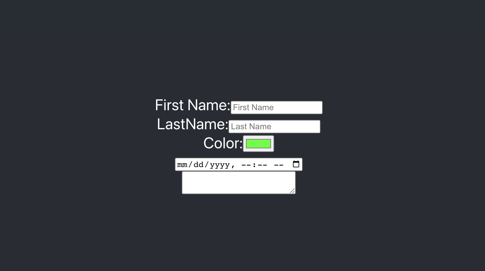

# Form Practice - React.js App 

Building a React app with onChange functionality for an HTML form in class practice.



## Covered In Class
* onChange
* Form Elements
* Controlled Components

## Basic Code
```

<label>First Name:
<input type="text">
<label/>

```


